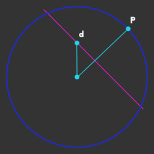

# Notes

- [part-01](#part-01)
- [part-02](#part-02)
- [part-03](#part-03)
- [part-04](#part-04)
- [part-05](#part-05)
- [part-06](#part-06)
- [part-07](#part-07)
- [part-08](#part-08)

# part-01
## drawing circle
- we want inCircle to be 1.0 when length(v_position.xy)>0.5
  and 0.0 when it is longer.
  
# part-02
## drawing square
### the custom function rect()
- takes 3 parameters :
- **pt** : the test pixel position
- **size** : width and height of rectangle
- **center** : the x and y position of the rectangle center

### the range of the v_position.xy varying

| p.x  | step(-0.5, p.x) | step(0.5, p.x) | horz |
| :--- | :-------------: | :------------: | ---: |
| -0.6 |        0        |       0        |    0 |
| 0.6  |        1        |       1        |    0 |
| p.y  | step(-0.5, p.y) | step(0.5, p.y) | vert |
| -0.6 |        0        |       0        |    0 |
| 0.6  |        1        |       1        |    0 |

1. we can use the step function more than once in a calculation.
2. if we are testing for the value being less than an edge value,
   then substract the return value from 1.0
3. we can create custom functions that return a value

# part-03
## moving shape
### sin and cos
- a full revolution in radians is 2 * PI
- adjust the size of the circle by multiplying by a value

# part-04
## rotating square 
### testing if pixel is in the square 
- is pixel between + and - halfsize ?

### getRotationMatrix 
- s = sin(theta)
- c = cos(theta)

|       |       |
| :---: | :---: |
|   c   |  -s   |
|   s   |   c   |

- trig functions sin and cos take radian parameters
- there are 2PI radians in a full revolution
- 2PI is about 6.28
- we can create a matrix in glsl using mat2, mat3 or mat4 constructors
- all glsl matrices are square (a mat2 is a 2x2 matrix)
- we can multiply a mat2 by a vec2 and so on

# part-05
## tiling
### uv values :

|            |            |
| :--------: | :--------: |
| (0.0, 1.0) | (1.0, 1.0) |
| (0.0, 0.0) | (1.0, 0.0) |

### position values : 

|                   |                  |
| :---------------: | :--------------: |
| (-1.0, 1.0, 0.0)  | (1.0, 1.0, 0.0)  |
| (-1.0, -1.0, 0.0) | (1.0, -1.0, 0.0) |

### the fract function :
- return a decimal value stripping off the whole number value :
  
|       |       |
| :---: | :---: |
|  1.5  |  0.5  |
|  6.7  |  0.7  |
|  3.3  |  0.3  |

- **plane model** coordinates are in the range -1 to 1
- **texture** coordinates are in the range 0 to 1
- **tiling** needs the coordinate space 0 to 1 to work best (texture coordinates -> uv values)

# part-06
## drawing circles
### smoothstep(edge0, edge1, n) :
- if n < edge0 returns 0.0
- if n > edge1 returns 1.0 
- if n is between edge0 and edge1 then a value between 0 and 1 is returned

# part-07
## drawing lines
- create a function :
  - line(a, b, line_width, edge_thickness)
  - returns 1.0 if b is between a + and - line_width
  - use smoothstep to soften the edge of the line

### using FragCoord.xy :
- we use screen space coordinates, which could be in the range 0.0 to 2000.0

### mix(a, b, n) :
- if n < 0.0 returns a 
- if n > 1.0 returns b
- if n is between 0.0 and 1.0 an interpolated value is returned
- by adding 1.0 and dividing by 2.0 we get a value between 0.0 and 1.0 (using the sin function which returns a vaule between -1.0 and 1.0 ...)

# part-08
## combining elements
### dot(a,b)
- dot(a,b) = a.x * b.x + a.y * a.y  
- h = dot(d,p)/dot(p,p)
- h is how far along p is a point on a line perpendicular to p that goes through d

  

### atan(d.x,d.y)
- atan returns an angle in the range + and - PI
- angles increase in an anti-clockwise direction

### mod(theta + atan(d.x, dy), 2PI)
- mod returns the reminder after division
- clamp restricts a value to a range